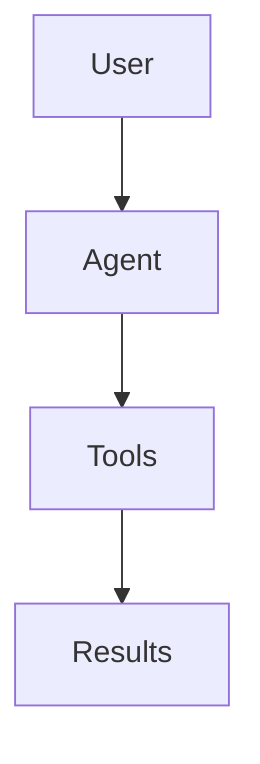
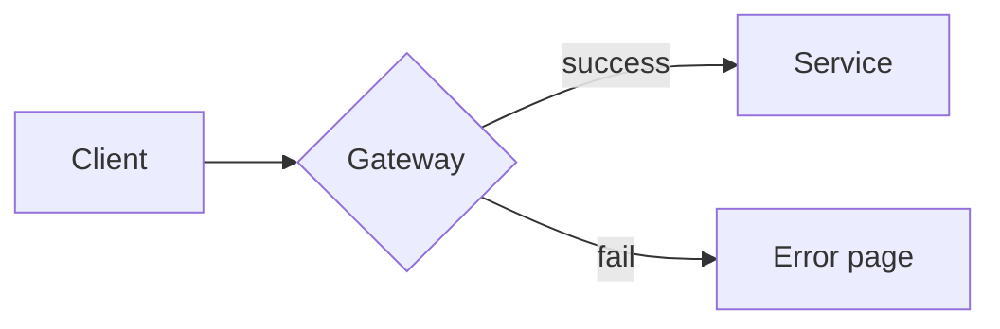
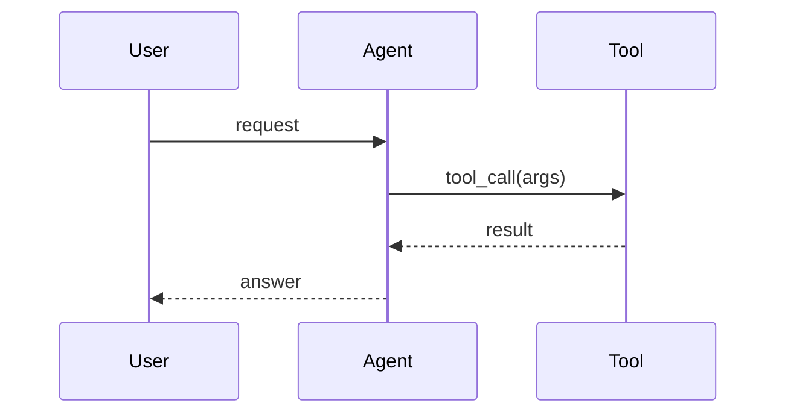
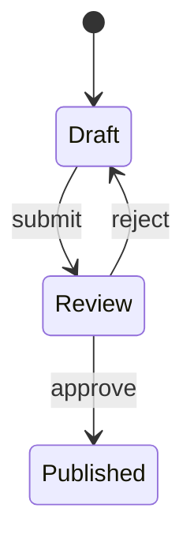
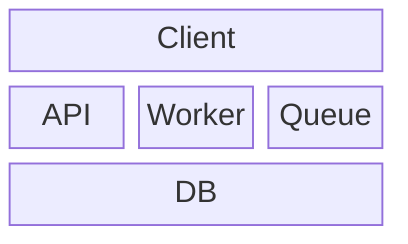

# Jennifer Builds

My personal engineering blog, built with [Astro](https://astro.build) + the [Retypeset](https://github.com/radishzzz/astro-theme-retypeset) theme, deployed on GitHub Pages.

**Live site:** https://jenniferbuilds.github.io

---

## How this site works (30-second version)

1. Blog posts are Markdown files in `src/content/posts/`
2. You push to the `main` branch on GitHub
3. GitHub Actions automatically builds and deploys the site (~1 min)
4. Done. Nothing else to manage.

---

## Table of Contents

- [Local development](#local-development)
- [Writing a new post](#writing-a-new-post)
- [Frontmatter reference](#frontmatter-reference)
- [Diagrams (Mermaid)](#diagrams-mermaid)
- [Images](#images)
- [Math (KaTeX)](#math-katex)
- [Code blocks](#code-blocks)
- [Editing the About page](#editing-the-about-page)
- [Deploying](#deploying)
- [Common tasks](#common-tasks)
- [Troubleshooting](#troubleshooting)

---

## Local development

Requires **Node.js ≥ 22** and **pnpm**.

```bash
pnpm install     # first time only
pnpm dev         # http://localhost:4321
```

Preview the production build locally:

```bash
pnpm build
pnpm preview
```

---

## Writing a new post

### Option A: use the generator (recommended)

```bash
pnpm new-post my-first-post
```

This creates `src/content/posts/my-first-post.md` with the frontmatter pre-filled.

### Option B: create the file by hand

Create `src/content/posts/my-first-post.md`:

```markdown
---
title: My First Post
published: 2026-09-15
description: 'A one-line summary shown under the title'
tags:
  - AI Agents
  - Notes
draft: false
---

Write your post here in Markdown.
```

Then `pnpm dev` and open http://localhost:4321 to see it.

### Post URL

The file name becomes the URL:

```
src/content/posts/my-first-post.md   →   /posts/my-first-post/
```

To use a custom URL instead, set `abbrlink`:

```yaml
abbrlink: 'agent-runtime-notes'   # → /posts/agent-runtime-notes/
```

---

## Frontmatter reference

Everything between the `---` lines at the top of a post:

| Field | Required | What it does |
|-------|----------|--------------|
| `title` | ✅ | Post title |
| `published` | ✅ | Publish date, e.g. `2026-09-15` |
| `description` | | One-line summary (used in lists & SEO) |
| `updated` | | Last-updated date (shows when set) |
| `tags` | | List of tags, e.g. `- AI Agents` |
| `draft` | | `true` = hidden from the site (default `false`) |
| `pin` | | `1–99` pins the post to the top (bigger = higher) |
| `toc` | | Table of contents on the right (default `true`) |
| `abbrlink` | | Custom URL slug |
| `lang` | | Leave empty (`''`) for English posts |

**Tip:** set `draft: true` while writing; flip to `false` when ready to publish.

---

## Diagrams (Mermaid)

Tech posts often need diagrams — this theme renders [Mermaid](https://mermaid.js.org/) automatically. Just use a ` ```mermaid ` code block.

### Flowchart (most common)

````markdown

````

renders:

```
User → Agent → Tools → Results   (as a real diagram)
```

More variants:

````markdown

````

### Sequence diagram

````markdown

````

### State diagram

````markdown

````

### Architecture / block diagram

````markdown

````

**Other supported types:** `erDiagram`, `gantt`, `pie`, `gitGraph`, `mindmap`, `timeline`, `xychart`…
Full syntax reference: https://mermaid.js.org/intro/

**Live editor:** prototype diagrams at https://mermaid.live and paste the code into your post.

### Simple ASCII diagrams

If a plain text diagram is enough, use a normal code block — no setup needed:

````markdown
```
User
  ↓
Agent
  ↓
Tools
  ↓
Results
```
````

---

## Images

1. Put the image file in the post's folder, e.g.

```
src/content/posts/my-first-post/
├── index.md
└── diagram.png
```

2. Reference it with a relative path:

```markdown

```

For hotlinked external images just paste the URL: ``.

---

## Math (KaTeX)

Inline: `$O(n \log n)$` → renders inline.

Block:

```markdown
$$
\text{score} = \alpha \cdot \text{similarity} + \beta \cdot \text{recency}
$$
```

---

## Code blocks

Use triple backticks with a language name for syntax highlighting:

````markdown
```python
def greet(name):
    return f"Hello, {name}!"
```
````
Common languages: `python`, `typescript`, `javascript`, `bash`, `json`, `yaml`, `go`, `rust`, `sql`, `html`, `css`, `markdown`.

---

## Editing the About page

The About page lives at:

```
src/content/about/about-en.md
```

Edit it like a normal Markdown file, commit, push — done.

---

## Deploying

Deployment is automatic. Every push to `main` rebuilds and publishes the site.

```bash
git add .
git commit -m "Add post: my-first-post"
git push
```

Then:

1. Watch progress: https://github.com/jenniferbuilds/jenniferbuilds.github.io/actions
2. Wait for the green check (~1 min)
3. Hard-refresh the site: **Cmd+Shift+R** (Mac) / **Ctrl+F5** (Windows)

> ⚠️ **Seeing an old page after deploying?** It's browser cache — hard-refresh first.

---

## Common tasks

| Task | Where |
|------|-------|
| New post | `pnpm new-post <name>` → edit `src/content/posts/<name>.md` |
| Edit site title / subtitle | `src/config.ts` → `site.title` / `site.subtitle` |
| Edit homepage description | `src/i18n/ui.ts` → `'en'.description` |
| Edit footer links | `src/config.ts` → `footer.links` |
| Edit About page | `src/content/about/about-en.md` |
| Change theme colors | `src/config.ts` → `color` |
| Enable comments | `src/config.ts` → `comment.enabled` |

---

## Troubleshooting

**`git push` fails with `Bad configuration option: usekeychain`**

Your `~/.ssh/config` has an option your SSH build doesn't support. Workaround:

```bash
GIT_SSH_COMMAND="ssh -F /dev/null -o IdentitiesOnly=yes -i ~/.ssh/id_ed25519" git push
```

Or permanently fix it by removing the `UseKeychain yes` line from `~/.ssh/config`.

**Local build shows stale content after deleting posts**

```bash
rm -rf node_modules/.astro .astro dist
pnpm build
```

**Mermaid diagram not rendering**

- Make sure the code fence is exactly ` ```mermaid ` (lowercase).
- Check syntax at https://mermaid.live first.

**Deployment failed**

Open the failing run in [Actions](https://github.com/jenniferbuilds/jenniferbuilds.github.io/actions) → click the red step → read the log. Most failures are frontmatter typos (e.g. unquoted `:` in a title) — the log will point at the file.

---

## Project structure

```
├── .github/workflows/deploy.yml   # auto-deploy to GitHub Pages
├── src/
│   ├── config.ts                  # ★ site settings (title, colors, footer…)
│   ├── content/
│   │   ├── posts/                 # ★ your blog posts live here
│   │   └── about/about-en.md      # ★ About page
│   ├── i18n/ui.ts                 # homepage title/description text
│   ├── components/ layouts/ pages/  # theme code (rarely touched)
│   └── styles/
├── scripts/new-post.ts            # pnpm new-post helper
└── astro.config.ts
```
